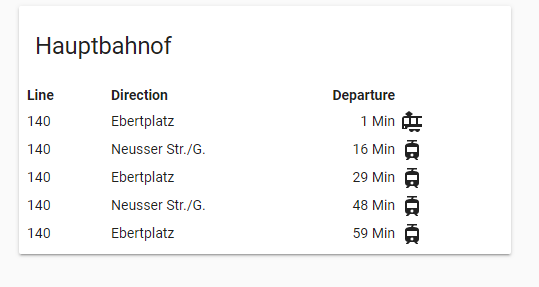

# KVB Departure Lovelace Card

This is the Lovelace UI Card for the kvbdeparture sensor



## Installation

1. Copy kvbdeparture-card.js to config/www
2. Add the card to the lovelace ressources
```yaml
lovelace:
  ...
  resources:
    - url: "local/kvbdeparture-card.js"
      type: module
  ...
```

3. Add card to your lovelace-ui.yaml / lovelace configuration

```yaml
- type: custom:kvbdeparture-card
  entity: sensor.kvbdep_308
```
